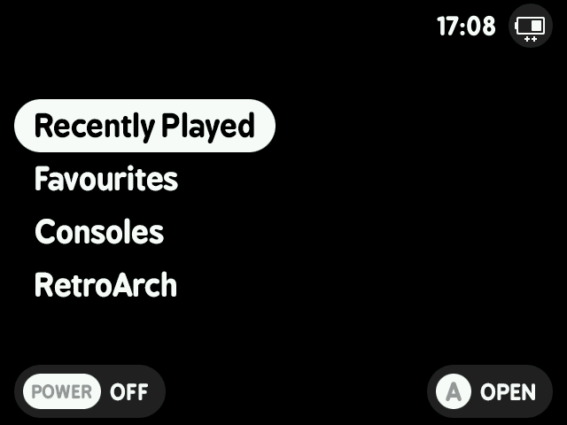

# MinUIfied Theme for GarlicOS

 

## How to Install
Download the theme [here](https://github.com/JCR64/GarlicOS-MinUIfied/archive/refs/heads/main.zip), extract and overwrite the files in the `CFW` folder on your SD Card. 

### Horizontal Menu

A horizontal option is included in the `alt_horizontal_menu` folder. It is less "MinUIfied" but due to GarlicOS expecting to scroll horizontally this will feel more natural with the D-Pad controls. Copy and paste these files into the `skin` folder if you would prefer this option.

### Boot Image

Included in the download is `boot_logo.bmp.gz`, copy it and overwrite the old boot logo in the `misc` partition of your SD card.

An alternative option is included for those that want something even more MinUIfied. Available in the `misc` folder as `alt_boot_logo.bmp.gz`.

### RetroArch RGUI

Open RetroArch from the GarlicOS menu, go into `Settings`, `User Interface`, `Appearance` and change `Menu Color Theme` to `Custom` and then set the Custom Menu Theme Preset to `MinUIfied`. Quit RetroArch and it will save automatically.

### Battery Charger Images

Copy the `battery` folder to the `misc` partition of your SD card, you will also need to overwrite `ramdisk.img` with the one included.

# Credits

- MinUI by shauninman
- White System Icons by Vidnez
- [ramdisk.img by adixal](https://codeberg.org/adixal/RG35XX/src/branch/main/mods/charger_images)
- Perfect_CRT Overlay by 1playerinsertcoin
