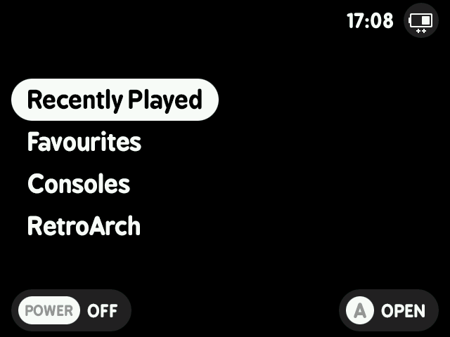

# MinUIfied Theme for GarlicOS

 

## How to Install
Download the theme [here](https://github.com/JCR64/GarlicOS-MinUIfied/archive/refs/heads/main.zip), extract and overwrite the files in the `CFW` folder on your SD Card. 

### Boot Image

Included in the download is `boot_logo.bmp.gz`, copy it and overwrite the old boot logo in the `misc` partition of your SD card.

### RetroArch RGUI

Open RetroArch from the GarlicOS menu, go into Settings, User Interface, Appearance and change Menu Color Theme to `Custom` and then set the Custom Menu Theme Preset to `MinUIfied`.
